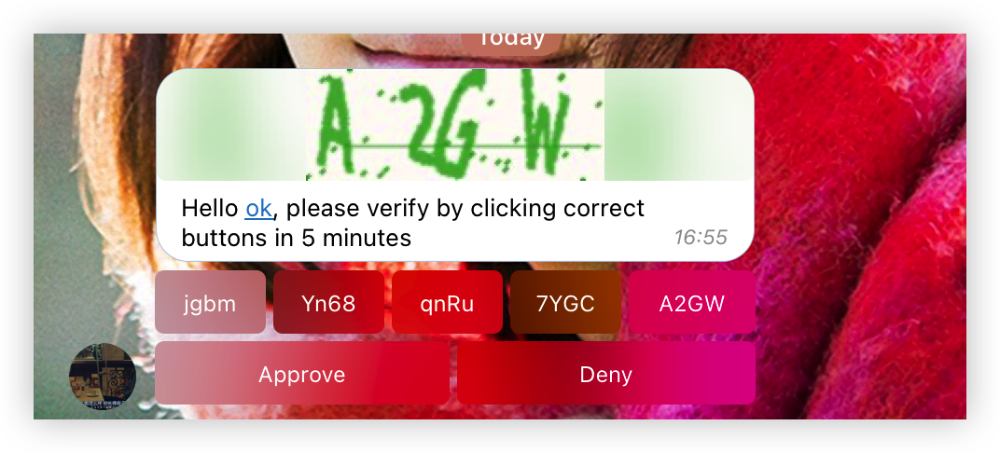
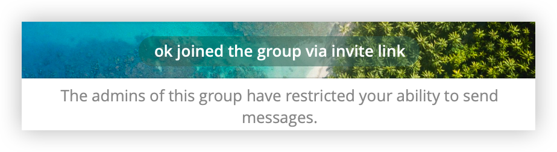

# Captcha Bot

Captcha challenge for group.

[https://t.me/benny_captcha_bot](https://t.me/benny_captcha_bot)


# screenshot




# Usage:

add bot to your group, assign it with admin privileges, and you're good to go.

# Deploy

environment variables:

* APP_ID
* API_HASH
* BOT_TOKEN
* REDIS

# Run

## Normal

first run redis, then `python main.py`

## Docker

create `env/joingroup.env`, fill in the variables

```shell
docker-compose up -d
```

# License

Apache License Version 2.0
